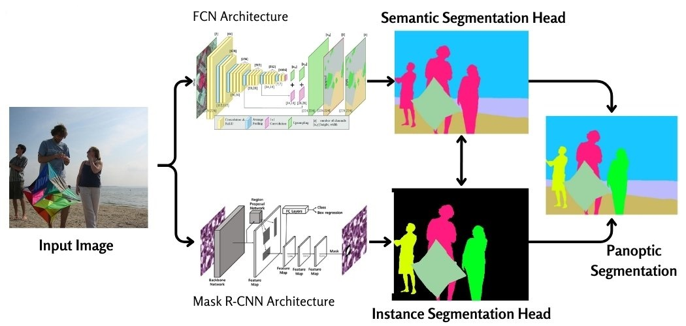

# Panoptic-Segmentation-on-Dendrites-and-Dendritic-Spines
This repository extends the <a href="https://github.com/ankilab/DeepD3">DeepD3</a> project by adding panoptic segmentation capabilities for the detailed analysis and quantification of dendrites and dendritic spines. It utilizes Mask R-CNN for instance segmentation of dendritic spines and FCN-ResNet for semantic segmentation of dendrites.

#### Table of Contents:
```
Panoptic-Segmentation-on-Dendrites-and-Dendritic-Spines/
├── docs/
├── notebooks/
├── report/
├── src/
│ ├── models/
│ │ ├── FCN_ResNet/
│ │ │ ├── checkpoint.py
│ │ │ ├── dataset.py
│ │ │ ├── inference.py
│ │ │ ├── main.py
│ │ │ ├── model.py
│ │ │ ├── train.py
│ │ │ ├── transforms.py
│ │ │ └── utils.py
│ │ ├── MaskRCNN/
│ │ │ ├── checkpoint.py
│ │ │ ├── dataset.py
│ │ │ ├── inference.py
│ │ │ ├── main.py
│ │ │ ├── model.py
│ │ │ ├── train.py
│ │ │ ├── transforms.py
│ │ │ └── utils.py
│ ├── panoptic_inference/
│ │ └── panoptic_inference.py
│ └── create_dataset.py
├── requirements.txt
├── README.md
```
## Panoptic Segmentation
[]([https://www.google.com](https://viso.ai/deep-learning/panoptic-segmentation-a-basic-to-advanced-guide-2024/))
Panoptic segmentation combines the strengths of semantic and instance segmentation by assigning both a semantic label and an instance ID to every pixel in the image. It assigns a unique label to each pixel, corresponding to either a “thing” (countable object instances like cars, people, or animals) or “stuff” (amorphous regions like grass, sky, or road).


## 1. Steps to Get Started:
Below are the steps that you can follow to run panoptic inference on pre-trained Instance and Semantic segmentation models on your dataset.
### Step 1: Clone this repository
```
git clone https://github.com/sahil-sharma-50/Panoptic-Segmentation-on-Dendrites-and-Dendritic-Spines.git
```
### Step 2: Download the instance and semantic model from FAUBox:
<ol>
  <li>Instance Segmentation Model for Spines: <a href='https://faubox.rrze.uni-erlangen.de/getlink/fiEfTXy8DJhqCzCksmgiC6/spines_model.pt'>MaskRCNN FAUBox</a></li>
  <li>Semantic Segmentation Model for Dendrites: <a href='https://faubox.rrze.uni-erlangen.de/getlink/fi7iUL8cVWUsA5w9ZFLj2A/dendrite_model.pt'>FCN_ResNet50</a></li>
</ol>

### Step 3: Install the `requirements.txt` file:
```
pip install -r requirements.txt
```
### Step 4: Run `panoptic_inference.py` script for inference:
Arguments:
1. `--instance_model_path:` Path to the instance model file (e.g., spines_model.pt).
2. `--semantic_model_path:` Path to the semantic model file (e.g., dendrite_model.pt).
3. `--input_images_folder:` Directory containing the input images (e.g., input_images).
4. `--output_folder:` Directory where the output will be saved (e.g., output_folder).
```
python src/panoptic_inference/panoptic_inference.py --instance_model_path spines_model.pt --semantic_model_path dendrite_model.pt --input_images_folder input_images --output_folder output_folder
```
<hr>

## 2. Train Your Instance and Semantic Model:
### Step 1: Download the Dataset
Download the DeepD3 dataset from Zenodo link: <a href='https://zenodo.org/records/8428849/files/DeepD3_Training_Validation_TIFF.zip?download=1'>DeepD3_Training_Validation_TIFF.Zip</a> 
### Step 2: Run `create_dataset.py` to extract images from .TIFF files:
This script extracts the images from the above-downloaded .tiff file and automatically converts the binary mask of spines into instance masks.
Arguments:
1. `--zip_path:` Path to the zip file (e.g., DeepD3_Training_Validation_TIFF.zip).
2. `--extract_path:` Path where to extract the zip file (e.g., DeepD3_Training_Validation_TIFF).
3. `--output_folder:` Directory where the output will be saved. (e.g. Dataset).
```
python src/create_dataset.py --zip_path DeepD3_Training_Validation_TIFF.zip --extract_path ./DeepD3_Training_Validation_TIFF --output_path ./Dataset
```
`Note:` Make sure that the above output dir (e.g. Dataset) is in the same folder.
```
├── Dataset/
│ ├── DeepD3_Training/
│ │ ├── dendrite_images/
│ │ │ ├── dendrite_0.png
│ │ │ ├── ...
│ │ │ ├── ...
│ │ ├── input_images/
│ │ │ ├── image_0.png
│ │ │ ├── ...
│ │ │ ├── ...
│ │ ├── spine_images/
│ │ │ ├── spine_0.png
│ │ │ ├── ...
│ │ │ ├── ...
│ ├── DeepD3_Validation/
│ │ ├── dendrite_images/
│ │ │ ├── dendrite_0.png
│ │ │ ├── ...
│ │ │ ├── ...
│ │ ├── input_images/
│ │ │ ├── image_0.png
│ │ │ ├── ...
│ │ │ ├── ...
│ │ ├── spine_images/
│ │ │ ├── spine_0.png
│ │ │ ├── ...
│ │ │ ├── ...
├── src/
```
### Command for "Instance Segmentation":
```
python src/models/MaskRCNN/main.py
```
`Inference`
```
python src/models/MaskRCNN/inference.py --model_path spines_model.pt --Validation_Folder Dataset/DeepD3_Validation/ --output_path spine_predictions
```
### Command for "Semantic Segmentation":
```
python src/models/FCN_ResNet/main.py
```
`Inference`
```
python src/models/FCN_ResNet/inference.py --model_path dendrite_model.pt --Validation_Folder Dataset/DeepD3_Validation/ --output_path dendrite_predictions
```
